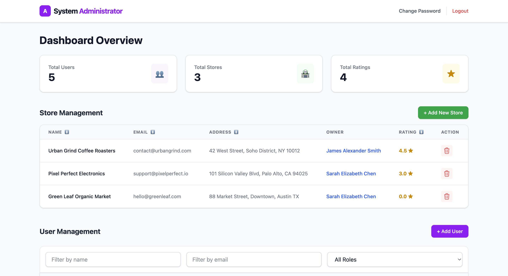
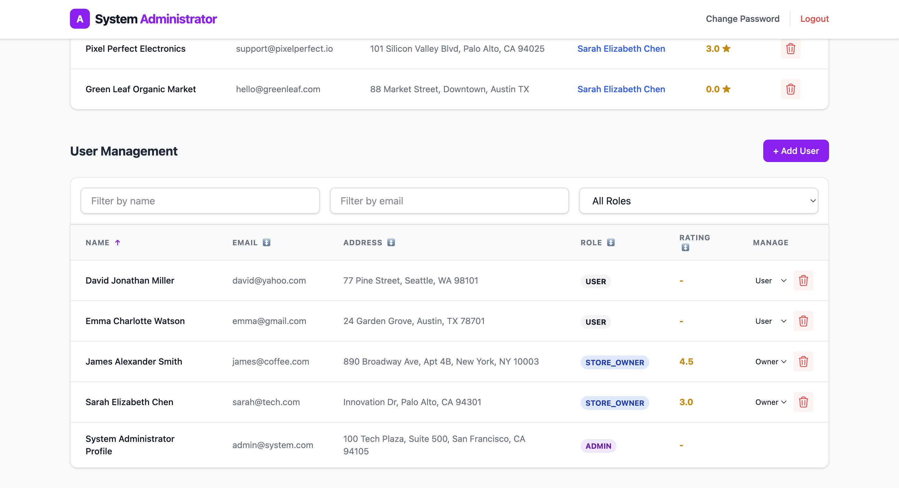
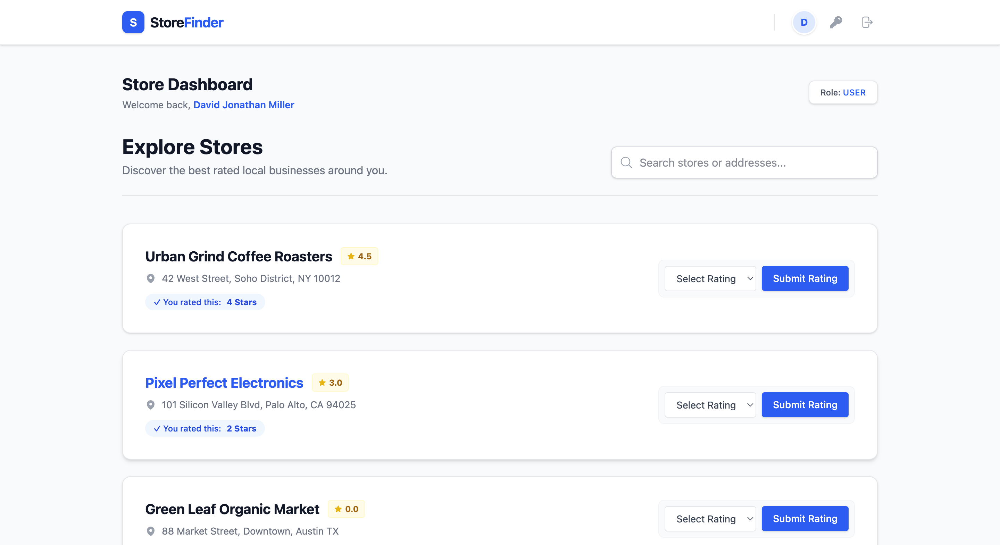

# StoreFinder

**A fullstack platform for discovering local businesses and submitting rated reviews.**

**🌐 Live App:** [store-eight-gules.vercel.app](https://store-eight-gules.vercel.app/)  
**⚙️ Backend:** [store-rating-app-lac-seven.vercel.app](https://store-rating-app-lac-seven.vercel.app/)

---

## Application

### 1. Admin Dashboard





### 2. Store Owner View


### 3. User Store Search



---

## Demo Credentials

Use these accounts to test the different user roles immediately:

| Role             | Email              | Password     |
| :--------------- | :----------------- | :----------- |
| **System Admin** | `admin@system.com` | `Admin@1234` |
| **Store Owner**  | `james@coffee.com` | `James@1234` |
| **Normal User**  | `emma@gmail.com`   | `Emma@1234`  |

---

## 💻 Local Setup

1.  **Clone & Install:**

    ```bash
    git clone https://github.com/YOUR_USERNAME/YOUR_REPO.git
    cd server && npm install
    cd ../client && npm install
    ```

2.  **Environment Variables (`.env`):**

    - **Server:** `DATABASE_URL`, `JWT_SECRET`
    - **Client:** `VITE_API_URL=http://localhost:5000/api`

3.  **Run:**
    - Server: `npm start`
    - Client: `npm run dev`

---

**Made by Ankit Jadhav**
